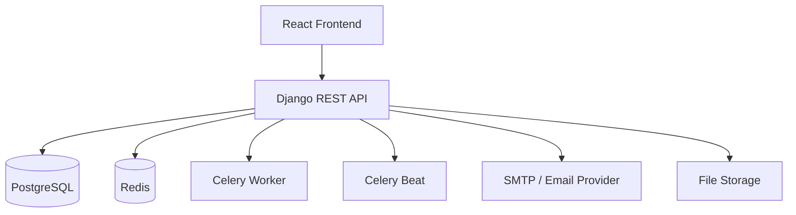
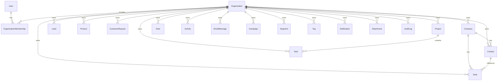

# PulseCRM

PulseCRM is an original, production-style multi-tenant CRM and business operations platform for small and medium-sized teams. It combines company/contact management, leads, sales pipeline, support requests, tasks, projects, email workflows, campaigns, segmentation, analytics, notifications, attachments, imports/exports, audit logging, and search.

## Stack

- Backend: Python 3.12+, Django 6, Django REST Framework, JWT, Celery, Redis, PostgreSQL
- Frontend: React, TypeScript, Vite, React Router, TanStack Query, Tailwind CSS, Recharts
- Quality: pytest, pytest-django, Ruff, TypeScript strict mode, GitHub Actions
- Infrastructure: Docker Compose with backend, frontend, PostgreSQL, Redis, Celery worker, and Celery Beat

## Architecture



## Database



## Run Locally

```bash
cp .env.example .env
docker compose up --build
```

Backend API: `http://localhost:8000/api/v1/`  
OpenAPI docs: `http://localhost:8000/api/docs/`  
Frontend: `http://localhost:3000/`

Seed demo data:

```bash
docker compose exec backend python manage.py seed_demo_data
```

Demo login: `owner` / `DemoPass123!`

## API Highlights

- `POST /api/v1/auth/register/`
- `POST /api/v1/auth/login/`
- `GET /api/v1/analytics/dashboard/`
- `POST /api/v1/leads/{id}/convert/`
- `POST /api/v1/deals/{id}/advance/`
- `POST /api/v1/tasks/{id}/complete/`
- `GET /api/v1/search/?q=term`

Tenant isolation is enforced server-side through membership-scoped querysets and workflow permission checks.
